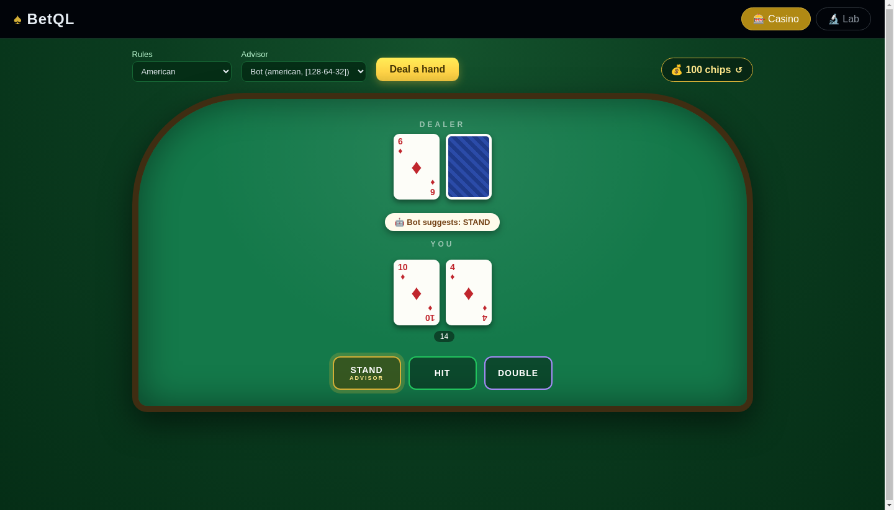
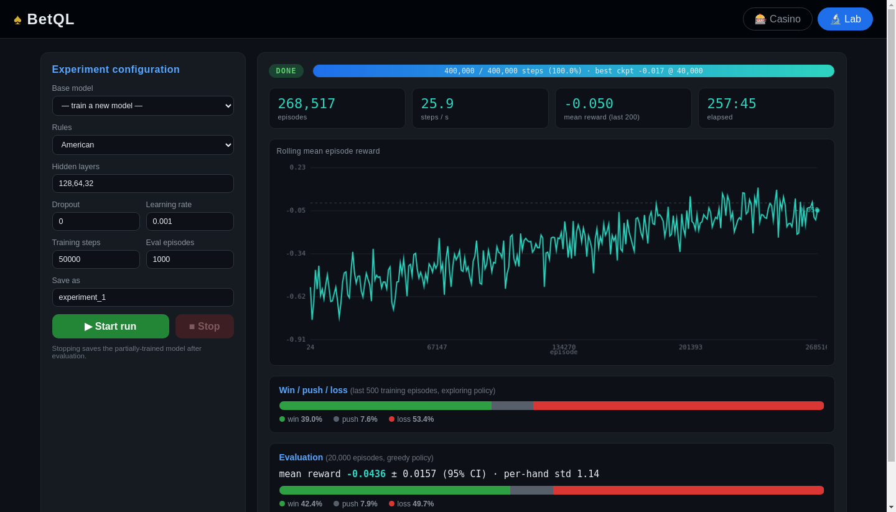

# BetQL — Blackjack Deep Reinforcement Learning 🃏


A full-stack blackjack laboratory: a **dueling Deep Q-Network** learns the game from scratch in a faithful casino simulator, and a polished web app lets you both **play against the house with the trained bot whispering advice** and **watch new agents learn live** on a scientific training dashboard.

<p align="center">
  
</p>
<p align="center"><em>🎰 The Casino — holding 14 against a dealer 6, the trained bot suggests the mathematically best move (the glowing gold button).</em></p>

<p align="center">
  
</p>
<p align="center"><em>🔬 The Lab — a finished 400,000-step run: full learning curve, live win/push/loss rates, best-checkpoint tracking, and the final 20,000-hand greedy evaluation.</em></p>

---

## 📑 Table of Contents

1. [Overview](#-overview)
2. [The Game — exactly what is simulated](#-the-game--exactly-what-is-simulated)
3. [The Agent — what the network sees and how it learns](#-the-agent--what-the-network-sees-and-how-it-learns)
4. [The Training Pipeline](#-the-training-pipeline)
5. [Evaluation Methodology](#-evaluation-methodology)
6. [Results](#-results)
7. [How does that compare? Blackjack agents & advantage players](#-how-does-that-compare-blackjack-agents--advantage-players)
8. [The Web App](#-the-web-app)
9. [Getting Started](#-getting-started)
10. [Project Structure](#-project-structure)
11. [Reading the Dashboard — an honest statistics guide](#-reading-the-dashboard--an-honest-statistics-guide)
12. [Future Development](#-future-development)

---

## 📜 Overview

BetQL trains a Deep Q-Network to play blackjack through pure self-play — no strategy charts, no hand-crafted rules, no card counting. The agent only ever sees the same information a human player has (its cards and the dealer's up-card) and learns when to **hit, stand, double down and split** purely from win/loss rewards. Everything is wrapped in a Flask web app with two faces:

- 🎰 **Casino** — an animated card table where *you* play: hit, stand, double and split with a chip bankroll, card-dealing animations and win/lose celebrations. Pick any trained model as your **advisor** and its suggested move glows gold on the action buttons.
- 🔬 **Lab** — a training dashboard where you design an agent (architecture, dropout, learning rate, rule set, steps), launch a run, and watch it learn in real time: rolling mean-reward chart, live win/push/loss rates, step throughput, ETA, automatic best-checkpoint tracking and a rigorous final evaluation with confidence intervals.

Crucially, **the training environment and the playing environment are the same code** — the agent doubles and splits during training under exactly the rules you play with in the Casino.

---

## 🎴 The Game — exactly what is simulated

`environments/blackjack_env.py` is an OpenAI Gym environment implementing a complete single-deck blackjack table:

- **Single 52-card deck, fully reshuffled before every hand.** This is a deliberate design choice: with a fresh deck each round, deck composition carries no exploitable information, so the agent's task is purely *strategy*, not counting.
- **Dealer draws to 17 and stands on all 17s** (including soft 17).
- **Player natural (two-card 21) pays 3:2.** A natural after splitting does not count as a natural.
- **One split allowed** per round (no re-splitting). After a split, both hands are played in sequence and resolved independently against the dealer.
- **Doubling down doubles the bet**, deals exactly one card, and ends the hand. Doubling **after a split is allowed** (each split hand starts with two cards).

### Rule variants

| | 🇺🇸 American | 🇪🇺 European |
|---|---|---|
| Dealer hole card | Dealt up front | None — dealer draws only after the player finishes |
| Dealer blackjack vs a doubled/split hand | Collects **only the original bet** (the peek would have ended the round before you doubled) | Collects the **full doubled bet** |
| Double down allowed on | **Any** first two cards | Only a two-card **hard 9, 10 or 11** |

### Action space & rewards

| Action | ID | Effect |
|---|---|---|
| Stand | 0 | End the current hand |
| Hit | 1 | Draw a card; bust (>21) ends the hand |
| Double | 2 | Double the bet, draw one card, hand ends |
| Split | 3 | Split a pair into two hands, one extra card each |

If the agent picks double or split in a state where it isn't legal, the environment **falls back to hit** — the agent can always act from any state, and it experiences the same fallback in training and in play.

Rewards are paid **per round, in units of the initial bet** (split hands sum):

| Outcome | Reward |
|---|---|
| Win / loss | +1 / −1 |
| Win / loss on a doubled hand | +2 / −2 |
| Push | 0 |
| Player natural | **+1.5** |
| Bust | −bet |
| Dealer natural (American) | −1 (original bet only) |
| Dealer natural (European) | −bet (doubles included) |

---

## 🧠 The Agent — what the network sees and how it learns

### State encoding: 32 binary inputs

The observation is a 32-dimensional one-hot vector — exactly the information visible to a human player, nothing more:

| Bits | Meaning |
|---|---|
| 19 | Player's best score, one-hot over 4…22 (22 = bust) |
| 10 | Dealer's up-card, one-hot over A…10 |
| 1 | Usable ace flag (an ace currently counted as 11) |
| 1 | "Double is legal now" flag |
| 1 | "Split is legal now" flag |

The two legality flags matter: without them, identical scores with different legal moves (e.g. a fresh 10+6 vs a hit-to 16) would be aliased into one state.

### Network: a dueling DQN

The default network is `128 → 64 → 32` fully-connected ReLU layers feeding a **dueling head** (`utils/qnet.py`):

```
Q(s, a) = V(s) + A(s, a) − mean_a A(s, a)
```

Instead of estimating four independent action values, the network separately learns *how good the situation is* (state-value V) and *how much each action deviates from that* (advantages A). In blackjack this is a natural fit — being dealt 20 is great almost regardless of what you do, while holding 16 vs a 10 is bad almost regardless — so factoring "situation quality" out of "action choice" makes learning more sample-efficient.

The dueling head is built directly into the shared network builder (rather than using keras-rl's wrapper), so saved checkpoints **reload anywhere without keras-rl** — including the web server's advisor, which must stay keras-rl-free (see [pipeline](#-the-training-pipeline)). Architecture, dropout and the dueling flag are stored in each model's metadata JSON, so saved models always rebuild correctly.

### Learning algorithm

Training uses Deep Q-Learning (`agents/q_learning_agent.py`, via keras-rl2) with:

- **Experience replay** — a 50,000-transition `SequentialMemory`; each gradient step trains on a random mini-batch of past experience, breaking the correlation between consecutive hands.
- **Soft target-network updates** (`target_model_update = 0.01`) — the bootstrap target slowly tracks the online network (τ = 0.01 per step), stabilizing the moving-target problem of Q-learning.
- **Adam optimizer**, learning rate 10⁻³ (configurable per run).
- **Annealed ε-greedy exploration** — ε decays linearly **1.0 → 0.05 over the first 80% of the run**, then stays at 0.05 so the last 20% refines near-greedily. Exploring at a constant rate forever would keep the policy from polishing its endgame.
- **Warm-up** of `min(1000, steps/10)` steps fills the replay buffer before any gradient updates.

### Continue training — done right

Resuming a saved model is *not* the same as starting fresh, and BetQL treats it differently in two ways:

1. The Lab form **auto-fills and locks** the architecture fields to the base model's stored metadata — you can't accidentally bolt a new head onto incompatible weights.
2. Exploration restarts at **ε = 0.2, not 1.0**. A resumed model already has a competent policy; re-annealing from 1.0 would flood the replay buffer with random play and visibly *degrade* the model before it recovers (we measured this: a resumed run with the fix starts around its old skill level instead of crashing back to random-play rewards).

---

## ⚙️ The Training Pipeline

### Process isolation (the keras-rl trap)

keras-rl2 calls `disable_eager_execution()` at import, dropping TensorFlow into graph mode. In graph mode, building a *second* Keras model invalidates the first one's predict function — fatal for a web server that must serve several advisor models at once. BetQL's solution:

- The **web server never imports keras-rl.** Playing/advising uses plain Keras models rebuilt from `utils/qnet.py` + saved weights.
- Every **training run executes in a freshly spawned subprocess** (`multiprocessing` spawn context), where keras-rl can do whatever it likes to the TF runtime without touching the server.
- The trainer streams progress to an **atomically written JSON status file** (write-to-temp + `os.replace`), which the server reads and the dashboard polls. Stopping a run is a flag file the trainer checks each step.

### Live metrics

A keras-rl callback records every episode's reward and computes, per status update: episode/step counters, throughput, ETA, the rolling mean-reward series (window 200, displayed from episode 1 with an expanding-mean warm-up — no missing head, no fake early spike), and win/push/loss rates over the last 500 episodes.

### Best-checkpoint saving

DQN performance is not monotonic — it wobbles as the replay buffer churns. Saving only the final weights would routinely throw away the best model of the run. So:

- Every **5% of the run**, the current network is frozen and evaluated greedily over **5,000 independent hands**; the best-scoring snapshot is kept on disk.
- At the end (or on early stop), the final weights get a full evaluation, the result is compared against the best checkpoint, and **whichever is better is saved** as the model (the status reports which one won).

---

## 🔬 Evaluation Methodology

Evaluation is performed by a dedicated **batched greedy evaluator** (`utils/evaluate.py`): up to 512 environments stepped simultaneously through one `predict_on_batch` call per decision, with ε = 0 (pure exploitation). It plays thousands of complete hands per second on CPU, which makes statistically *meaningful* evaluation cheap.

That matters because blackjack is brutally noisy. A single hand's reward has a standard deviation of **≈ 1.14** (in initial-bet units), so the 95% confidence interval of a mean over *n* hands is `±1.96 × 1.14 / √n`:

| Hands evaluated | 95% CI on mean reward |
|---|---|
| 200 (the live chart window) | ± 0.158 |
| 1,000 | ± 0.071 |
| 5,000 (checkpoint evals) | ± 0.032 |
| 20,000 (final evals) | ± 0.016 |

A 1,000-hand eval cannot distinguish a −4% bot from a +3% bot. BetQL's final evaluations use **20,000 hands** and the UI reports the mean **with its 95% confidence interval** (and the per-hand std separately), so you always know how much of what you see is signal.

**Mean reward *is* the expected value (EV) per hand** in units of the initial bet: −0.042 means the agent loses 4.2% of its bet per hand on average. This is the single correct metric for a blackjack agent — win rate is misleading, because doubles, splits and 3:2 naturals make some wins worth more than others (more on that [below](#-reading-the-dashboard--an-honest-statistics-guide)).

---

## 📊 Results

### Our agent: `Bot`

Trained in the Lab for **400,000 steps** (≈ 268,500 hands) — dueling DQN, hidden layers 128·64·32, no dropout, lr 10⁻³, American rules. The run's best checkpoint was selected automatically, then re-evaluated greedily over **20,000 fresh hands**:

| Metric | Value |
|---|---|
| Mean reward (EV per hand) | **−0.0416** (95% CI ± 0.0158) |
| Win rate | 42.6% |
| Push rate | 8.1% |
| Loss rate | 49.4% |
| Per-hand std | 1.14 |

For context: **random play loses ≈ 35% per hand; perfect basic strategy loses ≈ 0.5%.** Starting from zero knowledge, the agent learned its way across ~88% of the skill gap between random and perfect, with win/push/loss rates statistically indistinguishable from basic strategy's (42.4% / 8.5% / 49.1%) — the remaining EV gap lives in the rarer fine-grained decisions (exact double/split borderline cases).

The learning dynamics are visible in the Lab screenshot above: the live curve climbs from −0.55 toward the basic-strategy line over the run, but most of that climb is the **exploration rate annealing away** — greedy checkpoint evaluations show the underlying policy reaches near-final strength within the first ~40k steps, after which it polishes details and wobbles within eval noise.

---

## 🏆 How does that compare? Blackjack agents & advantage players

| # | Approach | Win rate (per hand) | Expected return (EV/hand) | Note |
|---|---|---|---|---|
| 1 | Ace sequencing / shuffle tracking | ~52%+ on steered hands | up to **+50%** on a known-ace hand | edge only on tracked hands |
| 2 | Card steering | n/p | up to **+25%** | per steered hand |
| 3 | Edge sorting (Phil Ivey) | n/p | **+20%+** | ruled cheating, winnings clawed back |
| 4 | Hole carding (perfect play + hole card) | ~52–53% | **+13%** | best "bot with extra info" benchmark |
| 5 | Don Johnson loss-rebate deals (2011) | ~42–43% | **≈ +2–3% effective**; $15M total | edge came from the rebate contract, not the cards |
| 6 | Card counting (MIT-style, good conditions) | ~43–44% | **+1% to +3%** | profit comes from bet spreading, not win rate |
| 7 | Wearable computers (Keith Taft's "George") | ~43–44% | **≈ +2%** | devices now banned |
| 8 | Deep RL with learned counting (Stanford CS230) | ~45% (reported) | **slightly positive** (simulation only) | only ML result claiming +EV |
| 9 | Curriculum-learning DQN (arXiv 2026) | **47.4%** | ~**−1% to −3%** (still negative) | best published RL win rate without counting |
| 10 | Perfect basic strategy | 42.4% | **−0.5%** | the ceiling without extra information |
| — | **BetQL `Bot` (400k steps, this repo)** | **42.6%** | **−4.2%** | no counting, learned purely by self-play |
| — | Typical published DQN / Monte-Carlo agents | 40–45% | **−2.7% to −12%** | most papers & repos land here |
| — | Random play | ~28% | ~**−35%** | the floor |

*("n/p" = not published — those techniques are reported as edge %, not win rate.)*

The takeaway: **no agent can beat blackjack from the visible cards alone** — perfect basic strategy's −0.5% is a mathematical ceiling, and everything above it in the table uses extra information (deck composition, the dealer's hole card) or extra contracts. BetQL's bot lands mid-pack of published DQN agents and within statistical reach of that ceiling, purely from self-play. The curriculum-DQN paper's 47.4% *win-rate* headline illustrates why EV is the honest metric: part of that win rate comes from refusing marginal busts, which EV already accounts for.

---

## 🖥 The Web App

### 🎰 Casino

- Choose the **rule set** (American/European) and an **advisor model** from the dropdowns, then **Deal a hand**.
- Action buttons show only **legal moves** for the current hand; the advisor's greedy suggestion glows **gold** with an `ADVISOR` tag and a "🤖 Bot suggests: …" pill above your cards.
- A **chip bankroll** tracks your session: bets, doubled bets and 3:2 naturals are accounted exactly as the environment pays the agent. Confetti when you win big; the bankroll can be reset anytime.
- Split hands are dealt out side by side and played in order, exactly as in training.

### 🔬 Lab

Every experiment parameter is set from the browser:

| Field | Meaning |
|---|---|
| Base model | Train fresh, or continue from any saved model (architecture auto-fills and locks; ε resumes at 0.2) |
| Rules | American or European — stored with the model |
| Hidden layers | Comma-separated sizes, e.g. `128,64,32` (the default) |
| Dropout | Dropout rate between hidden layers (default 0) |
| Learning rate | Adam learning rate (default 0.001) |
| Training steps | Total agent actions (≈ 1.5 actions per hand) |
| Eval episodes | Hands for the final greedy evaluation |
| Save as | Model name; weights + metadata land in `weights/` |

During a run the dashboard shows: phase badge, progress bar with ETA and the **best checkpoint so far**, episode/throughput/elapsed counters, the rolling mean-reward chart, and a live win/push/loss bar (last 500 episodes, exploring policy). **Stop** ends a run early — the partial model is still evaluated, compared with the best checkpoint, and saved.

### API

The UI is a thin client over a JSON API you can script against:

| Endpoint | Method | Purpose |
|---|---|---|
| `/api/models` | GET | List saved models with their metadata |
| `/api/train/start` | POST | Launch a training run (JSON config) |
| `/api/train/status` | GET | Full live status: phase, counters, chart series, rates, best checkpoint, eval |
| `/api/train/stop` | POST | Request a graceful stop |
| `/api/game/new` | POST | Deal a new hand (rules + optional advisor model) |
| `/api/game/<id>/action` | POST | Play stand/hit/double/split |

---

## 🚀 Getting Started

### Installation (Ubuntu)

1. Update your system packages:

```bash
sudo apt update -y && sudo apt upgrade -y
```

2. Install Python 3.7 and virtualenv if they are not installed:

```bash
sudo apt install python3.7 virtualenv -y
```

3. Clone the repository and enter it:

```bash
git clone git@github.com:mhmmdbdrhmd/BetQL.git
cd BetQL
```

4. Create and activate a virtual environment:

```bash
virtualenv venv --python=python3.7
source venv/bin/activate
```

5. Install the dependencies:

```bash
pip install -r requirements.txt
```

### Usage

**Web UI (recommended):**

```bash
python webapp/app.py                 # default port 5050
BETQL_PORT=8080 python webapp/app.py # custom port
```

Open http://127.0.0.1:5050 — the **Casino** tab to play (select `Bot` as your advisor), the **Lab** tab to train your own agents. A trained model (`Bot`, the one evaluated above) ships in `weights/`.

**Command line:**

```bash
python main.py
```

A text-mode menu offers the same flows: train (fresh or continued, with rule/architecture prompts) and play (with the advisor's suggestion highlighted in green).

### Tested on

- **Ubuntu 22.04** ✔️ — macOS and Windows not yet tested; feedback welcome.

---

## 🗂 Project Structure

```
BetQL/
├── main.py                       # CLI entry point (train / play menu)
├── agents/
│   └── q_learning_agent.py       # DQN agent: replay memory, soft target updates,
│                                 #   annealed ε-greedy, resume-aware training
├── environments/
│   └── blackjack_env.py          # Gym env: 4 actions, splits, doubles,
│                                 #   American & European rules, 3:2 naturals
├── utils/
│   ├── qnet.py                   # shared network builder (plain & dueling) + defaults
│   ├── evaluate.py               # batched greedy evaluator (512 parallel envs)
│   ├── model_store.py            # save/load with metadata JSON (rules, arch, dueling)
│   ├── train.py                  # CLI training flow
│   └── play.py                   # CLI play flow with advisor suggestions
├── webapp/
│   ├── app.py                    # Flask server; training in isolated subprocesses,
│                                 #   atomic status file, checkpoint/best-model logic
│   ├── templates/index.html      # Casino + Lab single-page UI
│   └── static/                   # table styling, cards, charts, dashboard logic
├── weights/                      # saved models: <name>.h5f.* + <name>.json metadata
└── docs/                         # README screenshots
```

---

## 📐 Reading the Dashboard — an honest statistics guide

A few things about the numbers that trip everyone up at first:

**Why does the live "mean reward (last 200)" look so much worse than the checkpoint evals early on?**
Because it measures the *exploring* policy. At the start of a run, ε ≈ 1.0 — the agent is playing nearly randomly *on purpose* — so the live curve sits near random-play territory (−0.5) even while the underlying greedy policy is already decent. As ε anneals to 0.05, the live curve converges toward true greedy skill. Most of the dramatic "learning curve" shape is exploration evaporating, not skill appearing.

**Why does the live curve sometimes spike above zero — is my bot beating the house?**
No. A 200-hand window has a 95% CI of ±0.16; a true −0.04 policy will regularly print +0.10 windows by pure luck. Read the rolling curve for its *slope*, never its individual values.

**Why is the "best checkpoint" often early in the run, and a bit better than the final eval?**
Two compounding effects. First, blackjack skill saturates early — the gap from "nothing" to "decent" is learned in the first tens of thousands of steps, and what remains is smaller than checkpoint-eval noise. Second, the *winner's curse*: each checkpoint eval is 5,000 hands (±0.032), and the recorded "best" is the *luckiest measurement*, not necessarily the best policy — it overstates true skill by roughly one noise margin. That's why saved models are re-evaluated on fresh hands before being reported (the Bot above: best checkpoint *measured* −0.0165; honest 20,000-hand re-eval −0.0416).

**Why judge by mean reward instead of win rate?**
A doubled win pays 2, a natural pays 1.5, and a good double/split strategy deliberately trades a little win *frequency* for more win *value*. Win rate also rewards degenerate strategies (never double, refuse marginal busts) that lose more money. EV per hand captures all of it in one number.

**Why can't any bot get above zero here?**
Each hand starts from a freshly shuffled deck, so there is no information to exploit beyond the visible cards — and with only those, perfect play still loses ≈ 0.5% (the house edge). Positive EV requires extra information (a card count over a multi-deck shoe, the dealer's hole card) — see the [comparison table](#-how-does-that-compare-blackjack-agents--advantage-players).

---

## 🔮 Future Development

- **Multi-deck shoes and card counting**: configurable shoe size and penetration, with deck-composition features added to the state — the only road to positive EV.
- **Further rule details**: surrender, insurance, re-splitting, and double-after-split restrictions for specific casino rule sets.
- **macOS / Windows testing.**

## 💖 Acknowledgments

- Thanks to all the open-source projects and tools that made this project possible.
- Special thanks to contributors and the Python and machine learning communities for their support and inspiration.
- Thanks to Nicholas Renotte for his informative videos on YouTube, which have provided valuable insights and guidance. [Watch here](https://www.youtube.com/@NicholasRenotte)

## 🤝 Contributing

Contributions to the project are welcome. Please refer to the contributing guidelines for more details on how to submit pull requests, report bugs, or suggest enhancements.

## 📄 License

This project is licensed under the MIT License - see the LICENSE file for details.


##
  <br>     
  
  </div>
  </div>

 <br><br>

<div align="center">
<div align="center"><p align="center">
    &nbsp;&nbsp;&nbsp;&nbsp;&nbsp;
    <a href="mhmmdbdrhmd@gmail.com" style="text-decoration: none;" alt="Email">
        
    </a>&nbsp;&nbsp;&nbsp;&nbsp;&nbsp;
    <a href="https://github.com/mhmmdbdrhmd" style="text-decoration: none;" alt="GitHub">
        
    </a>&nbsp;&nbsp;&nbsp;&nbsp;&nbsp;
    <a href="https://www.linkedin.com/in/mohamad-badri-ahmadi-aa2a1a8a?original_referer=https%3A%2F%2Fwww.google.com%2F" style="text-decoration: none;" alt="LinkedIn">
        
    </a>&nbsp;&nbsp;&nbsp;&nbsp;&nbsp;
  <a href="https://twitter.com/mhmmdbdrhmd" style="text-decoration: none;" alt="Twitter">
        
    </a>
    &nbsp;&nbsp;&nbsp;&nbsp;&nbsp;
</div>
</div>
